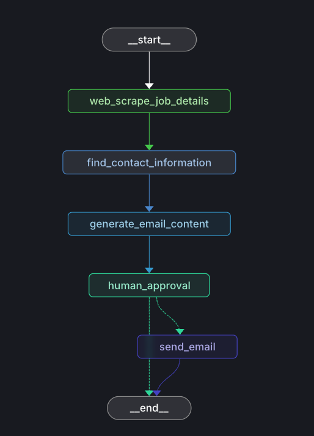
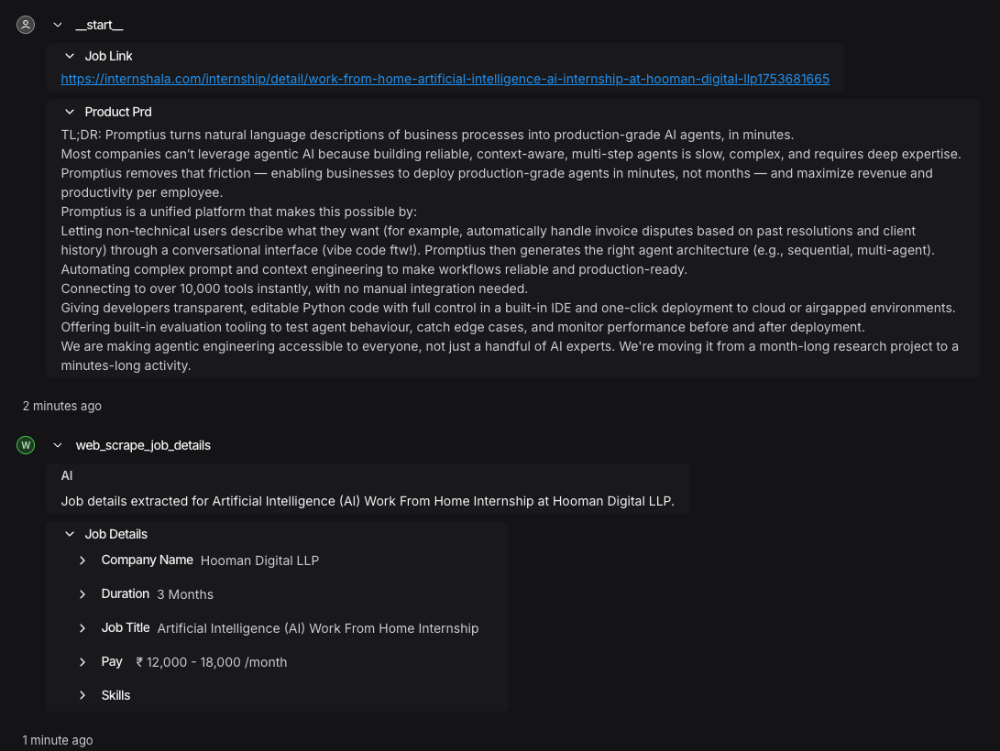
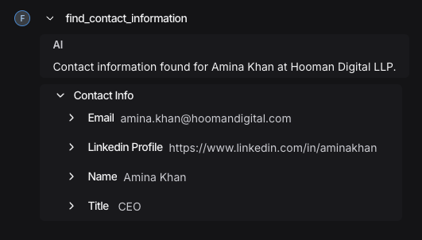
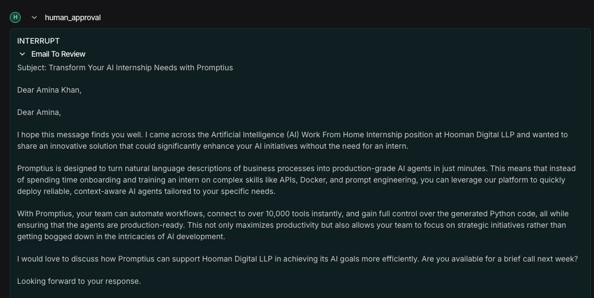
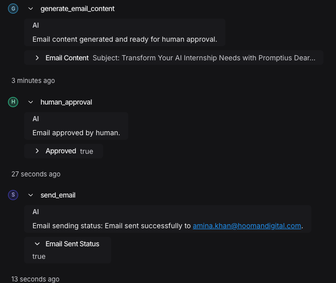

# Personalized Outbound Agent

The **Personalized Outbound Agent** is an intelligent automation tool designed to streamline and personalize outbound communications. It leverages AI to craft tailored messages, manage contact lists, and optimize outreach strategies for improved engagement and conversion rates.

## Features

- **Personalized Messaging:** Automatically generates customized messages for each recipient.
- **Contact Management:** Organizes and segments contact lists for targeted outreach.
- **Analytics & Reporting:** Tracks engagement metrics to refine communication strategies.
- **Integration Ready:** Easily integrates with existing CRM and email platforms.

## How It Works

1. **Input Contacts:** Import or add contacts to the agent.
2. **Configure Campaign:** Set up your outreach campaign and message templates.
3. **Automated Outreach:** The agent sends personalized messages based on recipient data.
4. **Monitor Results:** View analytics and adjust strategies for better outcomes.

## Folder Structure

```
personalized_outbound_agent/
├── assets/
│   ├── workflow.png
│   ├── dashboard.png
│   └── segmentation.png
├── main.py
├── README.md
└── ...
```

## Visual Overview

### Workflow as seen on langgraph studio




### Example Run
#### Passing input and scrape details

#### Find contact information

#### Email generation and human interrupt

#### Email sent

